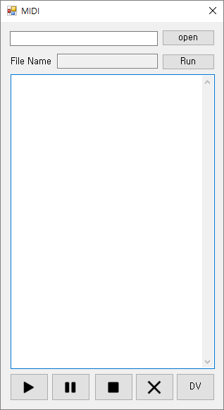
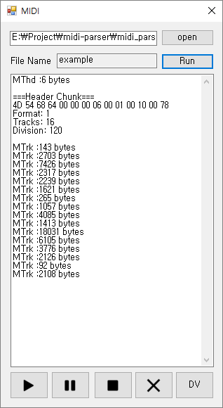
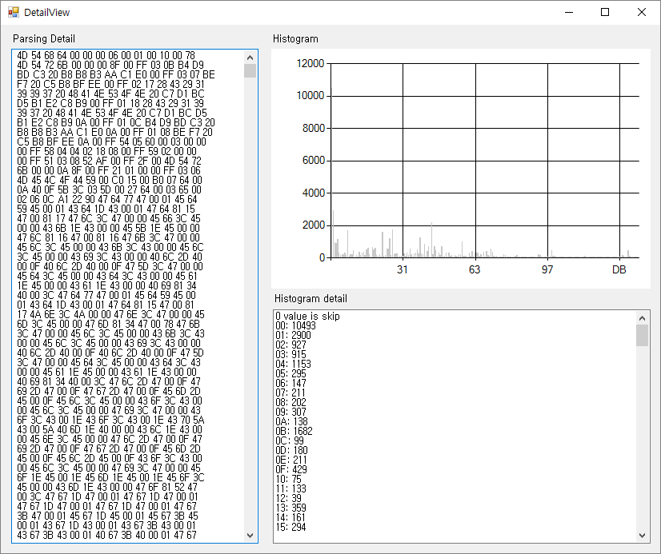

# midi-parser

basic form load the midi file with open button

click the run button that parser parsing the header and body's preview  
five button in the bottom the 1st is play, 2nd is pause, 3rd is stop, 4th is clear text area, and the last is show the parsing detail

Detail View show the detail of midi file with hexa code and histogram  
histogram detail is skip the 0 vales. 
